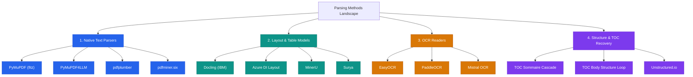

# Agentic Document Parsing & Synthesis Dispatcher: Know How You Decide, and the Parsing Methods You Pick From

> **Enterprise Document Intelligence Series [Vol.1 #5nonies]**  
> **Title**: Before Full Agentic RAG: Know How You Decide, and the Parsing Methods You Pick From  
> **Author**: Angela Shi  
> **Publication**: Towards Data Science  
> **Source URL**: [Towards Data Science Article](https://towardsdatascience.com/before-full-agentic-rag-know-how-you-decide-and-the-parsing-methods-you-pick-from/)  
> **Notebooks Repository**: [doc-intel/notebooks-vol1](https://github.com/doc-intel/notebooks-vol1)  
> **Core Principle**: *Nature, Plan, Execute, Synthesize* — Deterministic rule-based routing plus LLM leaves closes Brick 1 (Document Parsing) by reading each PDF's nature, picking the methods that fit (fitz, Docling, PaddleOCR, EasyOCR, MinerU, Surya, Azure DI, Vision LLMs), executing them with error isolation, and folding the outputs into one unified corpus dict.

---

## 1. Executive Summary & Why "Agentic" Stays in Quotes

AI engineers today talk constantly about *agentic AI*, and the pitch is seductive: *"let the model decide"*.
- For a general-purpose conversational chatbot, letting an LLM try random tools and observe what happens is acceptable.
- For an **enterprise RAG pipeline** feeding real financial, legal, medical, or engineering decisions, unconstrained autonomy is dangerous. Every parsing step must be deterministic, reproducible, auditable, and bounded in latency and cost.

```mermaid
flowchart TD
    subgraph MarketBuzzword["The Buzzword 'Agentic' Myth"]
        M1[Document Ingestion] --> M2["Black-box LLM Supervisor<br/>(Improvises tool calls on the fly)"]
        M2 --> M3["Unpredictable Token Burn &<br/>Non-deterministic Outputs"]
    end

    subgraph HonestDispatcher["Honest Enterprise Dispatcher (Vol.1 #5nonies)"]
        D1[Document Ingestion] --> D2["1. Nature Probe<br/>(6 Deterministic Heuristics; 0 LLMs)"]
        D2 --> D3["2. Plan Generator<br/>(Ordered MethodStep list with required/optional flags)"]
        D3 --> D4["3. Execute Shim<br/>(_run_step adapters with error isolation)"]
        D4 --> D5["4. Multi-Frame Synthesize<br/>(_pick_richer relational folding into unified corpus)"]
    end
```



### The 4 Functions of the Dispatcher
1. `detect_document_nature(pdf_path)`: Six deterministic flags extracted from `line_df` and `span_df`. **0 LLM calls**.
2. `plan_parsing_methods(nature)`: Deterministic Python routing returning a hard-coded ordered list of `MethodStep`. **0 LLM calls**.
3. `parse_pdf_agentic(pdf_path, llm_parse=...)`: Iterates through the plan, invoking one adapter per method. LLMs live strictly inside leaf workers (e.g. typography validator, chart descriptor), never at the dispatch layer.
4. `synthesize_parsing_outputs(step_outputs)`: Multi-frame relational DataFrame merger using the `_pick_richer` heuristic. **0 LLM calls**.

---

## 2. The 6 Deterministic Signals of Document Nature

Before executing any heavy parsing engine, the dispatcher runs a coarse probe on the file's binary headers, native metadata, and first-pass PyMuPDF (`fitz`) text/span stream:

| Signal Flag | Detection Heuristic & Probe Logic | Downstream Method Triggered |
| :--- | :--- | :--- |
| `is_scanned` | `line_df` is empty OR row count sits well below threshold ($\frac{\text{row count}}{\text{page count}} < 2.0$). | `easyocr_scan`, `paddleocr`, or `mistral_ocr` |
| `has_native_outline` | `doc.get_toc()` returns non-empty list of bookmark tuples `(lvl, title, page)`. | `fitz_native_toc` (free, instantaneous) |
| `has_sommaire` | Early pages ($\le 10\%$ of doc) contain $\ge 5$ dot-leader lines (`Title ........ 12`). | `toc_sommaire` cascade (Cases 1–3) |
| `is_composite` | Style ruptures, numbering re-initializations, or multiple title/cover pages detected. | Document boundary segmenter & multi-part router |
| `has_rich_figures` | Embedded raster/vector image density exceeds median threshold for prose documents. | `vision_llm_figures` & `image_pipeline` |
| `has_tables_signal` | Whitespace coordinate clustering detects $\ge 3$ aligned columns across $\ge 3$ consecutive lines. | `docling_tables` or `azure_layout` |

---

## 3. The 4-Family Parsing Method Catalog (Identity Cards)

The open-source and cloud parsing ecosystem spans 4 distinct functional families:



### Identity Cards Summary Table

| Method Name | Family | License | Runs | Speed | LLM? | Preserves Style? | Primary Output | Best Used For |
| :--- | :--- | :--- | :--- | :--- | :--- | :--- | :--- | :--- |
| **PyMuPDF (`fitz`)** | Native Text | AGPL-3.0 | Local / CPU | ⚡ <10ms/pg | No | Yes (font, size, flags) | `line_df`, `span_df` | Base foundation for every PDF with text layer |
| **PyMuPDF4LLM** | Native Text | AGPL-3.0 | Local / CPU | ⚡ <15ms/pg | No | Partial | Markdown | Quick markdown export for vector RAG |
| **pdfplumber** | Native Text | MIT | Local / CPU | 🟡 ~50ms/pg | No | Yes (exact bbox) | Ruled Table Cells | Form-like documents with visible border lines |
| **pdfminer.six** | Native Text | MIT | Local / CPU | 🟡 ~80ms/pg | No | High detail | Raw Char Bounding Boxes | Low-level coordinate debugging |
| **Docling** | Layout/Table | MIT | Local / GPU-opt | 🟠 ~400ms/pg | No | Structure-only | Hierarchical Tables & Markdown | Native nested complex table cell extraction |
| **Azure DI Layout** | Layout/Table | Commercial | Cloud API | 🟠 ~500ms/pg | No | Font weights only | Hierarchical Tables & Key-Values | Enterprise SLAs with zero local GPU infrastructure |
| **MinerU** | Layout/Table | AGPL-3.0 | Local / GPU | 🔴 ~1000ms/pg | No | Partial | Formula LaTeX + Tables | Heavy academic papers with math formulas |
| **Surya** | Layout/Table | GPL-3.0 | Local / GPU | 🟠 ~300ms/pg | No | Bounding boxes | Layout Order & Line Detection | Multi-column reading order detection |
| **EasyOCR** | OCR Reader | Apache-2.0 | Local / GPU-opt | 🔴 ~800ms/pg | No | No (words only) | Word Bounding Boxes | Scanned pages when free/offline is required |
| **PaddleOCR** | OCR Reader | Apache-2.0 | Local / GPU | 🟠 ~400ms/pg | No | No | Words + Angles | High-accuracy multilingual OCR |
| **Mistral OCR** | OCR Reader | Commercial | Cloud API | 🟠 ~350ms/pg | Yes | Markdown headers | Structured Markdown from Pixels | Complex scanned pages with tables and headers |
| **TOC Sommaire** | Structure | Custom / Open | Local / CPU | ⚡ <20ms/pg | No | Yes | `toc_df` | Native PDFs with printed dot-leader contents pages |
| **TOC Body Loop** | Structure | Custom / Open | Local + LLM | 🟡 ~150ms/pg | Yes | Yes (6 typography signals) | `toc_df` | LaTeX / arXiv papers with no TOC page |
| **Vision LLM Figures**| Multimodal | Cloud / API | Cloud API | 🔴 ~1500ms/fig| Yes | No | `image_df` (captions & data) | Charts, graphs, infographics, architectural diagrams |

---

## 4. Execution Dispatcher & Error Isolation Architecture

Every step in the generated plan is wrapped in a standardized adapter shim `_run_step(step)`:

```python
class MethodStep(BaseModel):
    method: str
    rationale: str
    optional: bool = False
    config: dict = {}

def parse_pdf_agentic(pdf_path: str, llm_parse: callable = None) -> dict:
    # 1. Nature
    nature = detect_document_nature(pdf_path)
    
    # 2. Plan
    plan = plan_parsing_methods(nature)
    
    step_outputs = []
    
    # 3. Execute
    for step in plan:
        try:
            out = _run_step(step, pdf_path, step_outputs, llm_parse=llm_parse)
            step_outputs.append({"method": step.method, "output": out, "status": "success"})
        except Exception as e:
            if step.optional:
                # Capture error and keep pipeline moving
                step_outputs.append({"method": step.method, "error": str(e), "status": "skipped"})
            else:
                # Load-bearing requirement failed: fail loudly
                raise RuntimeError(f"Required parsing step '{step.method}' failed: {e}")
                
    # 4. Synthesize
    enriched_corpus = synthesize_parsing_outputs(step_outputs, nature, plan)
    return enriched_corpus
```

---

## 5. Corpus Synthesis & the `_pick_richer` Heuristic

The synthesized corpus is an enterprise-standard relational dictionary composed of 6 standard DataFrames:
1. `line_df`: All lines with bounding box `(x0, y0, x1, y1)`, page number, font size, bold flag, color.
2. `span_df`: Granular span-level typography tokens.
3. `toc_df`: Hierarchical outline with `(level, title, start_page, end_page, source)`.
4. `table_df`: Structured tabular data with cell coordinates, headers, and markdown exports.
5. `image_df`: Visual assets, bounding coordinates, visual captions, and structured chart summaries.
6. `reference_df`: Bibliography entries, citations, and external URLs.
7. `sources`: Complete provenance audit trail listing the method responsible for each frame.

### The `_pick_richer` Resolution Rule:
When multiple methods extract overlapping frames (e.g. `fitz_native_toc` vs `toc_body_structure`, or `docling_tables` vs `azure_layout`):
1. **Preserve native frames** verbatim where available.
2. If two methods produce the same frame key, select the strictly more informative frame (e.g. higher row count with compatible schema, or deeper hierarchical levels).
3. If schemas are complementary (e.g. Docling markdown tables + Azure bounding box coordinates), perform relational concatenation with provenance tagging.

---

## 6. Real Walkthrough: NeurIPS Attention Paper (`1706.03762v7.pdf`)

Running `parse_pdf_agentic()` on the 15-page canonical paper *Attention Is All You Need*:

1. **Detected Nature**:
   - `is_scanned`: `False`
   - `has_native_outline`: `True` (`doc.get_toc()` returns 15 top-level sections)
   - `has_sommaire`: `False`
   - `is_composite`: `False`
   - `has_rich_figures`: `True` (Figure 1 Transformer model architecture & attention heatmaps)
   - `has_tables_signal`: `True` (WMT 2014 translation benchmark tables)
   - **Nature Label**: `native-with-outline`

2. **Generated 4-Step Plan**:
   - Step 1: `fitz_native` *(Mandatory, Cheap baseline line_df / span_df extraction)*
   - Step 2: `fitz_native_toc` *(Mandatory, Instant extraction of 15 native outline entries)*
   - Step 3: `toc_body_structure` *(Advisory, Reconstructs deeper Level 3 subsections missed by native outline)*
   - Step 4: `image_pipeline` *(Optional, Extracts raster bounding boxes and captions for model architecture figures)*

3. **Synthesized Output**:
   - `line_df`: 1,048 rows
   - `span_df`: 3,480 rows
   - `toc_df`: 22 rows (15 native + 7 enriched subsections)
   - `table_df`: 4 benchmark tables
   - `image_df`: 5 figures
   - **Total Latency**: ~380ms
   - **Dispatcher LLM Calls**: 0 (1 local leaf LLM call for level-3 body headings)

---

## 7. Cost & Regimes: Ex-Ante Agentic vs Lazy Adaptive Parsing

| Dimension | Ex-Ante Agentic Dispatcher (This Article) | Lazy Adaptive Parsing (Vol.2 Preview) |
| :--- | :--- | :--- |
| **Trigger** | Upon document upload / ingestion | Upon user query during retrieval |
| **Scope** | Whole document parsed completely | Only pages/sections hit by search anchors |
| **Latency** | 200ms – 15s (one-time ex-ante) | 50ms – 2s (added to query time) |
| **Cost Profile** | Higher initial ingest cost; zero per-query parse cost | Minimal ingest cost; recurring query compute |
| **Best For** | High-value contracts, patents, papers read repeatedly | 100,000+ page archives where 95% of pages are never queried |
| **Traceability** | Full deterministic audit log stored with document | Dynamic execution trace per query session |
