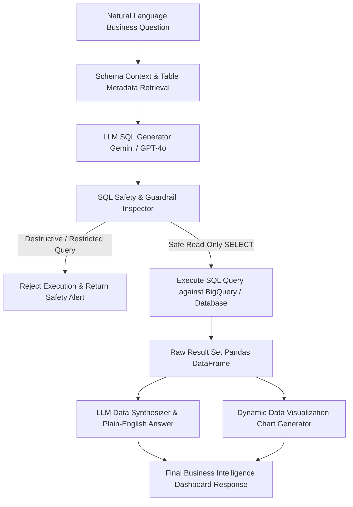

# I Built an AI Data Agent Which Can Query Data and Answer Business Questions: Here’s How

> **Article Metadata**  
> **Title**: I Built an AI Data Agent Which Can Query Data and Answer Business Questions: Here’s How  
> **Publication**: Towards Data Science | AI Data Analytics Series  
> **Source URL**: [Towards Data Science Article](https://towardsdatascience.com/i-built-an-ai-data-agent-which-can-query-data-and-answer-business-questions-heres-how/)  
> **Core Principle**: Natural Language Prompt $\rightarrow$ SQL Query Generation $\rightarrow$ Schema Validation & Safety Guardrails $\rightarrow$ Execution $\rightarrow$ Plain-English Business Answer + Charting.

---

## Executive Summary & Problem Context

Traditional BI dashboards provide static reports, but business stakeholders frequently ask spontaneous ad-hoc analytical questions such as:
- *"What was our total sales volume in Q3 across EMEA?"*
- *"Which customer tier had the highest churn rate last month?"*
- *"Compare monthly revenue between product lines A and B for 2025."*

Building an autonomous **AI Data Agent** allows users to converse directly with enterprise data warehouses (e.g. Google BigQuery, Snowflake, PostgreSQL) while maintaining data security, query validation, and execution safety.



---

## 1. Core Architecture & Pipeline Steps

### 4-Stage Execution Loop
1. **Natural Language Question Parsing**: Translates business intent into structured analytical requirements.
2. **Context-Aware SQL Generation**: Injects database schema definitions (column names, data types, table joins) into the LLM system prompt.
3. **Safety & Schema Validation**:
   - Enforces read-only `SELECT` queries (blocks `DROP`, `DELETE`, `UPDATE`, `INSERT`, `TRUNCATE`).
   - Prevents SQL injection and unauthorized table access.
4. **Data Synthesis & Visualization**: Summarizes query result rows into conversational business insights and renders interactive charts (Bar, Line, Pie, Metric Cards).

---

## 2. Complete Python Implementation & SQL Agent Architecture

```python
import os
import json
import re
from typing import Dict, Any, List
import pandas as pd

class AIDataAgent:
    def __init__(self, db_schema: Dict[str, Any], llm_client=None):
        self.schema = db_schema
        self.llm_client = llm_client
        self.allowed_tables = set(db_schema.keys())

    def format_schema_context(self) -> str:
        """Render database schema into system prompt context."""
        context = ["DATABASE SCHEMA:"]
        for table, meta in self.schema.items():
            context.append(f"\nTable: `{table}`")
            context.append(f"Description: {meta.get('description', '')}")
            context.append("Columns:")
            for col, dtype in meta.get("columns", {}).items():
                context.append(f"  - {col} ({dtype})")
        return "\n".join(context)

    def validate_sql(self, sql_query: str) -> Dict[str, Any]:
        """Inspect generated SQL for safety guardrails."""
        query_upper = sql_query.upper().strip()

        # Rule 1: Read-only SELECT enforcement
        if not query_upper.startswith("SELECT") and not query_upper.startswith("WITH"):
            return {"valid": False, "error": "Security Violation: Only SELECT queries are permitted."}

        # Rule 2: Block destructive keywords
        forbidden_keywords = ["DROP", "DELETE", "UPDATE", "INSERT", "ALTER", "TRUNCATE", "EXEC", "GRANT"]
        for kw in forbidden_keywords:
            if re.search(r'\b' + kw + r'\b', query_upper):
                return {"valid": False, "error": f"Security Violation: Forbidden keyword '{kw}' detected."}

        return {"valid": True, "error": None}

    def generate_sql(self, question: str) -> str:
        """Translate natural language question into BigQuery SQL."""
        system_prompt = (
            "You are an expert SQL Data Analyst. "
            "Convert user business questions into valid BigQuery SQL queries.\n"
            f"{self.format_schema_context()}\n"
            "Return ONLY the SQL query without markdown or explanation."
        )

        if self.llm_client:
            # LLM API call
            sql = self.llm_client.generate(system_prompt, question)
            return sql.strip().strip("```sql").strip("```")

        # Mock SQL fallback generator
        return f"SELECT region, SUM(revenue) AS total_revenue FROM sales WHERE year = 2025 GROUP BY region ORDER BY total_revenue DESC;"

    def run_agent(self, question: str) -> Dict[str, Any]:
        """Execute full AI data agent loop."""
        sql = self.generate_sql(question)
        validation = self.validate_sql(sql)

        if not validation["valid"]:
            return {
                "question": question,
                "sql": sql,
                "error": validation["error"],
                "data": None,
                "answer": "Failed to execute query due to safety restrictions."
            }

        # Execute Query (Mock / Real DB)
        mock_data = [
            {"region": "EMEA", "total_revenue": 1450000},
            {"region": "NA", "total_revenue": 2100000},
            {"region": "APAC", "total_revenue": 980000},
        ]
        df = pd.DataFrame(mock_data)

        answer = f"Total revenue in 2025 was highest in North America ($2.1M), followed by EMEA ($1.45M) and APAC ($980K)."

        return {
            "question": question,
            "sql": sql,
            "data": df.to_dict(orient="records"),
            "answer": answer,
            "chart_type": "bar",
        }
```

---

## 3. Data Leakage & Security Guardrail Checklist

1. **Read-Only Enclosure**: Restricts database connections to read-only user roles.
2. **Schema Masking**: Excludes PII columns (SSN, credit card numbers, passwords) from the LLM prompt context.
3. **Query Timeout & Row Limit**: Enforces default `LIMIT 1000` to prevent query cost runaway on BigQuery.
4. **SQL Injection Defense**: Uses strict regex keyword blocking and AST parser validation.

---

## 4. Sources & References

1. Towards Data Science. [I Built an AI Data Agent Which Can Query Data and Answer Business Questions: Here’s How](https://towardsdatascience.com/i-built-an-ai-data-agent-which-can-query-data-and-answer-business-questions-heres-how/). TDS.
2. Google Cloud BigQuery API. [BigQuery Analytics Docs](https://cloud.google.com/bigquery/docs).
