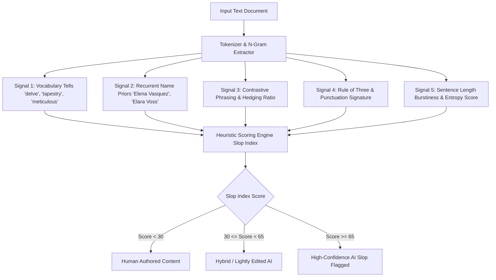

# Is This Slop? Detecting AI-Generated Content Without a Model

> **Article Metadata**  
> **Title**: Is This Slop? Detecting AI-Generated Content Without a Model  
> **Publication**: Towards Data Science | Content Intelligence & AI Quality Control Series  
> **Source URL**: [Towards Data Science Article](https://towardsdatascience.com/is-this-slop-detecting-ai-generated-content-without-a-model-2/)  
> **Core Principle**: Model-free heuristic detection — Statistical vocabulary frequencies, recurrent name priors, contrastive phrasing, and RLHF distribution collapse expose LLM-generated text without GPU inference.

---

## Executive Summary & Heuristic Philosophy

Machine-learning-based AI detectors suffer from low precision and high false-positive rates, frequently misidentifying non-native English writing or academic prose as AI-generated. 

A **model-free, heuristic-based detection engine** analyzes statistical tells, stylistic signatures, and vocabulary distribution spikes that stem directly from Supervised Fine-Tuning (SFT) and Reinforcement Learning from Human Feedback (RLHF).



  
*Figure 1: Frequency explosion of words like "delve", "intricate", and "meticulous" in scientific writing post-ChatGPT — Image from Kobak et al. (2024), CC BY-SA 4.0.*

---

## 1. Five Heuristic Signal Categories

### 1. Vocabulary Tells ("Overused LLM Buzzwords")
LLM training alignment heavily penalizes blunt phrasing, favoring polite, grandiloquent terms:
```python
LLM_VOCABULARY_TELLS = [
    "delve", "boast", "intricate", "tapestry", "realm", "showcase", 
    "pivotal", "underscore", "meticulous", "leverage", "robust", 
    "seamless", "testament", "comprehensive", "multifaceted", "navigate", 
    "interplay", "beacon", "foster", "endless possibilities", "game-changer"
]
```

### 2. Recurrent LLM Name Priors ("The Ghost Couple")
Models exhibit strong, unprompted probabilistic preferences for specific character names:

  
*Figure 2: Recurrent name priors in LLMs — Adapted from Brzozowski & Chung (2026).*

| Model Architecture | High-Probability Recurrent Name Priors |
| :--- | :--- |
| **Claude (Anthropic)** | `Elena Vasquez`, `Marcus Chen`, `Amara Okafor` |
| **GPT Series (OpenAI)** | `Elara Voss`, `Alex Chen`, `Dev Patel`, `Marcus Webb` |
| **Gemini (Google)** | `Aris Thorne`, `Lena Petrova`, `Nadia Volkov` |

### 3. Rhetoric & Sentence Structure Tells
- **Contrastive Phrasing**: Excessive use of *"It’s not just X; it’s Y"*, *"While X is important, Y is critical"*.
- **Linguistic Hedging**: Over-qualifying statements (*"It is important to remember that...", "It’s crucial to note..."*).
- **The Rule of Three**: Structuring lists strictly in triplets (*"efficient, scalable, and robust"*).

### 4. Punctuation & Formatting Tells
- Over-reliance on em-dashes (`—`) for explanatory parentheticals.
- Title-case bolding of every sub-bullet point.

### 5. Burstiness & Perplexity Proxy (Entropy Loss)
Human writing exhibits high **burstiness** (alternating between short punchy sentences and complex compound sentences). LLM outputs exhibit low variance and uniform sentence lengths.

$$\text{Burstiness} = \frac{\sigma_{\text{sentence\_length}}}{\mu_{\text{sentence\_length}}}$$

Low burstiness ($\le 0.25$) strongly indicates AI generation.

---

## 2. Complete Python Slop Detection Engine

```python
import re
import math
from typing import Dict, Any, List

class AISlopDetector:
    def __init__(self):
        self.vocab_tells = set(LLM_VOCABULARY_TELLS)
        self.name_priors = {
            "elena vasquez", "marcus chen", "amara okafor",
            "elara voss", "alex chen", "dev patel", "marcus webb",
            "aris thorne", "lena petrova", "nadia volkov"
        }

    def analyze_text(self, text: str) -> Dict[str, Any]:
        words = re.findall(r'\b\w+\b', text.lower())
        sentences = [s.strip() for s in re.split(r'[.!?]+', text) if s.strip()]

        if not words or not sentences:
            return {"slop_score": 0, "rating": "Empty Text"}

        total_words = len(words)
        
        # 1. Vocab Tells Score
        vocab_matches = [w for w in words if w in self.vocab_tells]
        vocab_ratio = len(vocab_matches) / total_words

        # 2. Name Priors Score
        name_matches = [n for n in self.name_priors if n in text.lower()]

        # 3. Burstiness Score (Standard Deviation / Mean Sentence Length)
        sent_lengths = [len(re.findall(r'\b\w+\b', s)) for s in sentences]
        mean_len = sum(sent_lengths) / len(sent_lengths)
        variance = sum((l - mean_len) ** 2 for l in sent_lengths) / len(sent_lengths)
        std_dev = Math.sqrt(variance) if variance > 0 else 0
        burstiness = std_dev / mean_len if mean_len > 0 else 1.0

        # 4. Contrastive Phrasing Score
        contrastive_matches = len(re.findall(r'\b(not only|it\'s not just|while|however, it is|crucial to note)\b', text.lower()))

        # Composite Slop Index Formula (0 - 100)
        score = 0
        score += min(40, (vocab_ratio * 1000))
        score += len(name_matches) * 20
        score += min(20, contrastive_matches * 5)
        if burstiness < 0.3:
            score += 20  # Penalize uniform sentence lengths

        slop_score = min(100, round(score))
        
        rating = "Human Authored"
        if slop_score >= 65:
            rating = "High-Confidence AI Slop"
        elif slop_score >= 35:
            rating = "Hybrid / Lightly Edited AI"

        return {
            "slop_score": slop_score,
            "rating": rating,
            "vocab_tells_found": list(set(vocab_matches)),
            "name_priors_found": name_matches,
            "burstiness_metric": round(burstiness, 3),
            "sentence_count": len(sentences),
        }
```

---

## 3. Sources & References

1. Towards Data Science. [Is This Slop? Detecting AI-Generated Content Without a Model](https://towardsdatascience.com/is-this-slop-detecting-ai-generated-content-without-a-model-2/). TDS.
2. Kobak et al. (2024). *Delving into ChatGPT usage in academic writing through excess vocabulary*. arXiv:2406.07016.
3. Brzozowski, M., & Chung, N. C. (2026). *The Ghost Couple: Correlated LLM Name Priors*. arXiv:2606.02184.
