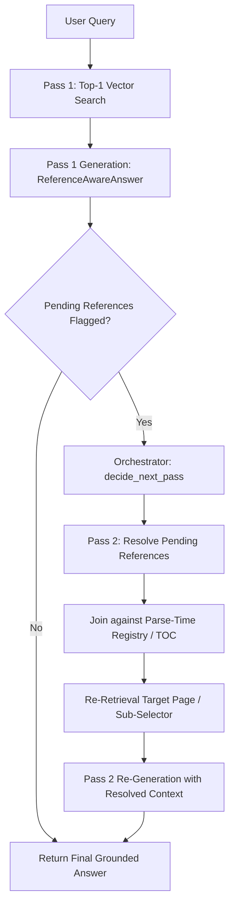

# Loop Engineering for Cross-References: When RAG Answers ‘see Section 7.2’ Instead of the Actual Answer

> **Article Metadata**  
> **Title**: Loop Engineering for Cross-References: When RAG Answers ‘see Section 7.2’ Instead of the Actual Answer  
> **Author**: Angela Shi  
> **Publication**: Towards Data Science | Enterprise Document Intelligence [Vol.1 #11]  
> **Source URL**: [Towards Data Science Article](https://towardsdatascience.com/loop-engineering-for-cross-references-when-rag-answers-see-section-7-2-instead-of-the-actual-answer/)  
> **GitHub Repository**: [doc-intel/notebooks-vol1](https://github.com/doc-intel/notebooks-vol1)  
> **Core Principle**: Pass 1 flags incompleteness; orchestrator triggers Pass 2; converged answer ships with provenance.

---

## Executive Summary & Problem Context

In standard RAG pipelines, top-k vector search retrieves passage chunks based solely on semantic query similarity. However, enterprise technical PDFs (academic papers, federal standards, financial reports) frequently contain internal cross-references such as:
- *"For hyperparameters, see Table 3 row (E)"*
- *"Details are described in Section 7.2"*
- *"Refer to Appendix B for full proof"*

When a chunk containing `"see Table 3 row (E)"` is retrieved, a naive LLM generator produces incomplete answers like:  
❌ *"According to the paper, the result is given in Table 3 row (E)."*

### The 2-Pass Loop Engineering Solution
Instead of forcing expensive high-k chunk retrieval at parse time, we implement a **lazy 2-pass orchestrator loop**:



  
*Figure 1: Pass 1 flags incompleteness; orchestrator triggers Pass 2; converged answer ships with provenance — Image by Author.*

---

## 1. Where Cross-References Live in Each Parsing Brick

| Brick Stage | Reference Extraction Strategy | Computational Cost | Storage Impact |
| :--- | :--- | :--- | :--- |
| **Brick 1: Parse Time** | Lazy regex extraction of `"see Section X"`, `"Table Y"` from `line_df` | Very Cheap ($O(N)$ text scan) | Appends lightweight `ReferenceRow` table |
| **Brick 2: Chunking** | Stores origin page/line and anchor text metadata | Negligible | Keeps chunk payload small |
| **Brick 3: Retrieval** | Top-1 retrieval initially (does NOT fetch all referenced sections upfront) | Minimal token cost | Avoids context window inflation |
| **Brick 4: Generation** | LLM flags pending references in structured output schema | Single evaluation pass | Triggers Pass 2 only when references exist |

---

## 2. Complete Data Models & Pydantic Schemas

```python
from pydantic import BaseModel
from typing import Optional, List

class ReferenceRow(BaseModel):
    origin_page: int          # Page where the reference appears
    origin_line: int          # Line where the reference appears
    anchor_text: str          # e.g., "see Table 3 row (E)" or "see Section 7.2"
    reference_type: str       # "table", "section", "figure", "appendix"


class Citation(BaseModel):
    page: int
    line: int
    text_snippet: str


class PendingReference(BaseModel):
    anchor_text: str          # e.g. "Table 3 row (E)"
    origin_page: int
    reason: str               # Why this reference is needed to complete the answer


class ReferenceAwareAnswer(BaseModel):
    answer: str                                     # The prose answer
    citations: List[Citation]                       # Line-level provenance
    pending_references: List[PendingReference]      # Unresolved references requiring Pass 2
```

---

## 3. The Orchestrator Feedback Loop Logic

```python
def decide_next_pass(
    answer: ReferenceAwareAnswer,
    loop_count: int,
    max_loops: int = 1
) -> str:
    """Determine whether to return the answer to user or trigger Pass 2 reference resolution."""
    if loop_count >= max_loops:
        return "return_to_user"
    if not answer.pending_references:
        return "return_to_user"
    return "resolve_references"
```

---

## 4. Pass 2: Reference Resolution Engine

  
*Figure 2: Resolution engine joins pending references against parse-time registries and TOC data — Image by Author.*

```python
class ResolvedReference(BaseModel):
    anchor_text: str
    target_page: int
    target_sub_selector: Optional[str] = None       # e.g., "row (E)"
    resolved_content: str
    status: str                                      # "exact_match", "llm_fallback", "failed"


def resolve_pending(
    ref: PendingReference,
    toc_df,
    object_registry: dict,
    line_df,
    llm_client=None
) -> ResolvedReference:
    """Resolve one pending reference via deterministic join or LLM fallback."""
    anchor = ref.anchor_text.strip()

    # Step 1: Exact Registry Match (Tables & Figures)
    if anchor in object_registry:
        obj = object_registry[anchor]
        return ResolvedReference(
            anchor_text=anchor,
            target_page=obj["page"],
            target_sub_selector=obj.get("sub_selector"),
            resolved_content=obj["content"],
            status="exact_match"
        )

    # Step 2: TOC Match (Sections & Appendices)
    matching_toc = [t for t in toc_df if t["title"].lower() in anchor.lower()]
    if matching_toc:
        target = matching_toc[0]
        # Fetch lines for target section
        section_lines = [l["text"] for l in line_df if l["page_num"] == target["page"]]
        return ResolvedReference(
            anchor_text=anchor,
            target_page=target["page"],
            resolved_content="\n".join(section_lines[:15]),
            status="exact_match"
        )

    # Step 3: LLM Fallback Resolution
    if llm_client:
        # LLM resolves ambiguous text anchors
        ...

    return ResolvedReference(
        anchor_text=anchor,
        target_page=ref.origin_page,
        resolved_content="",
        status="failed"
    )
```

---

## 5. Visual Traces & Worked Examples

  
*Figure 3: Pass 1 top-1 retrieved passage containing the forwarding reference pointer — Image by Author.*

  
*Figure 4: Second-pass fetch retrieving Table 3 row (E) carrying exact BLEU and perplexity metrics — Image by Author.*

### Comparison of Answers

#### Pass 1 Unresolved Output:
```json
{
  "answer": "According to the Transformer paper, the authors experimented with learned positional embeddings as an alternative to sinusoidal encodings, reporting results in Table 3 row (E).",
  "pending_references": [
    {
      "anchor_text": "Table 3 row (E)",
      "origin_page": 5,
      "reason": "Missing exact BLEU score numbers"
    }
  ]
}
```

#### Pass 2 Converged Output:
```json
{
  "answer": "The Transformer paper compares learned positional embeddings against sinusoidal encodings. Both produce nearly identical results: 28.4 BLEU on English-to-German (Table 3 row E), but sinusoidal encodings are preferred because they allow the model to extrapolate to sequence lengths unseen during training.",
  "citations": [
    { "page": 5, "line": 12, "text_snippet": "Positional Encoding section" },
    { "page": 9, "line": 4, "text_snippet": "Table 3 row (E): 28.4 BLEU" }
  ],
  "pending_references": []
}
```

---

## 6. Four Types of Cross-References

1. **Table Row / Cell Pointers**: `"see Table 3 row (E)"` $\rightarrow$ Target: Exact table row serialization.
2. **Section / Chapter Anchors**: `"see Section 7.2"` $\rightarrow$ Target: Section `start_page`/`end_page` via `toc_df`.
3. **Figure Captions**: `"refer to Figure 4"` $\rightarrow$ Target: Figure image + caption text block.
4. **Appendix References**: `"see Appendix B"` $\rightarrow$ Target: Supplementary appendix section.

---

## 7. Sources & References

1. Shi, Angela. [Loop Engineering for Cross-References: When RAG Answers ‘see Section 7.2’ Instead of the Actual Answer](https://towardsdatascience.com/loop-engineering-for-cross-references-when-rag-answers-see-section-7-2-instead-of-the-actual-answer/). TDS.
2. Vaswani et al. [Attention Is All You Need](https://arxiv.org/abs/1706.03762). NeurIPS 2017.
