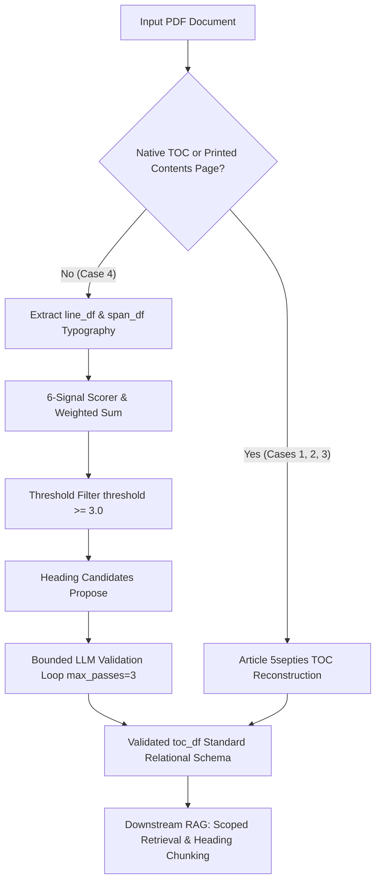
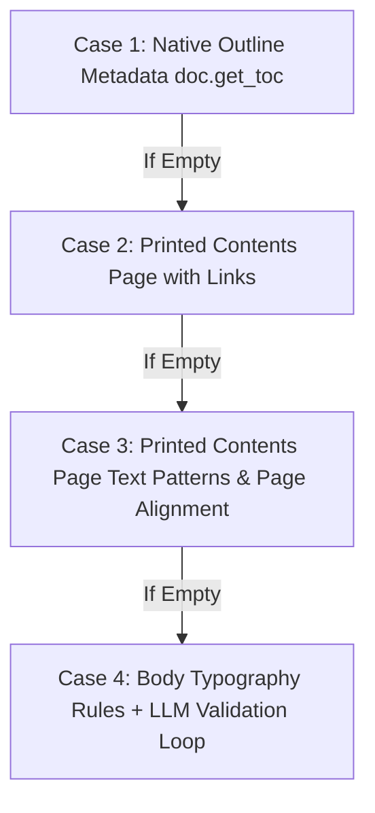
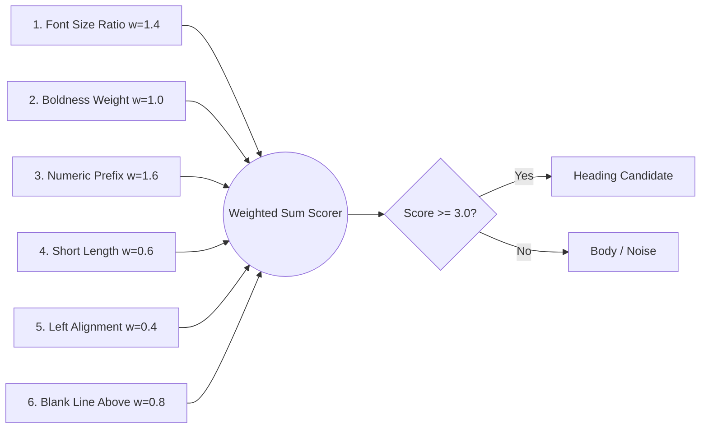
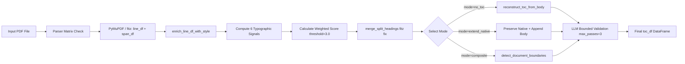

# Building Document Structure with Loop Engineering: Recovering a PDF’s Outline from Body Typography for RAG

> **Article Metadata**  
> **Title**: Building Document Structure with Loop Engineering: Recovering a PDF’s Outline from Body Typography for RAG  
> **Author**: Angela Shi  
> **Publication**: Towards Data Science | Enterprise Document Intelligence [Vol.1 #5octies]  
> **Source URL**: [Towards Data Science Article](https://towardsdatascience.com/building-document-structure-with-loop-engineering-recovering-a-pdfs-outline-from-body-typography-for-rag/)  
> **GitHub Repository Notebooks**: [doc-intel/notebooks-vol1](https://github.com/doc-intel/notebooks-vol1)  
> **Core Principle**: Rules propose, LLM validates — Six deterministic signals on span-level typography surface heading candidates, one bounded loop keeps the real ones, and the same `toc_df` drops back into the RAG pipeline.

---

## Executive Summary & Series Context

A structured RAG pipeline relies heavily on a document’s Table of Contents (`toc_df`). The TOC provides crucial structural metadata:
1. **Retrieval Scopes**: Restricts semantic vector search to specific sections via `start_page` and `end_page`.
2. **Chunking Boundaries**: Enables document splitters to slice on exact semantic heading boundaries rather than arbitrary mid-sentence token windows.

### The Missing TOC Problem
Many enterprise PDFs lack a Table of Contents entirely:
- A paper exported straight from LaTeX (e.g., arXiv preprints) has no native outline metadata (`doc.get_toc()` returns `[]`) and prints no contents page.
- **Article 5septies** handled documents that print a physical table of contents page (reconstructing `toc_df` from printed TOC text or links).
- **Article 5octies (This Work)** tackles documents with **no contents page at all**. The headings exist directly within the body text—visually distinct via larger fonts, bold weights, and left alignments.

This guide details how the pipeline rebuilds `toc_df` from body typography using a hybrid architecture: **Deterministic Rules Propose Candidate Headings -> Bounded LLM Loop Validates & Refines**.



---

## 1. Where This Article Sits & What It Does

This article sits inside **Brick 1 (Document Parsing)** of the *Enterprise Document Intelligence* framework. It closes the TOC-reconstruction thread opened across the series:

- **Article 5**: Document Parsing Basics — Beyond `extract_text`.
- **Article 5B**: Relational Shape RAG Needs — Standard `line_df`, `span_df`, and `toc_df` data models.
- **Article 5septies**: Reconstructing TOC from printed Table of Contents pages (Cases 1–3).
- **Article 5octies (This Work)**: Reconstructing TOC from Body Typography (Case 4).

  
*Figure 1: Architectural placement inside Brick 1 (Document Parsing), Part II — Image by Author.*

### Moving the Frontier: Case 4 as a First-Class Parser
Earlier designs treated body structure recovery as a vague summarization fallback. However, summarization loops carry severe drawbacks: long-context requirements, prompt instability, no guaranteed output schema, and lost page source tracking.

By treating body-typography reconstruction as a **fourth deterministic-plus-LLM detection case**, we preserve the exact relational `toc_df` schema used across the rest of the enterprise RAG system.

#### Input / Output Contract
* **Input**: `line_df` (and optional `span_df` when font typography is exposed) for documents where native outlines and printed TOC pages returned empty.
* **Output**: Standardized `toc_df` DataFrame containing `title`, `page`, `level`, and `source` (`body_structure`).

#### 3 Immediate Upstream / Downstream Beneficiaries
1. **Unstructured PDFs**: Full outline built from scratch.
2. **Partial Outlines**: Deepens shallow native outlines (e.g., native TOC stops at Level 2, body contains Level 3 `3.2.1`).
3. **Composite Bundles**: Reconciles concatenated documents where section numbering re-initializes mid-file.

---

## 2. Four Cases, One Cascade

The TOC reconstruction cascade evaluates document structure in order of cost and certainty (**cheapest first**):



  
*Figure 2: Case 4 is opt-in and represents the only cascade stage where an LLM performs active candidate validation rather than simple coherence checking — Image by Author.*

### Cascade Case Summary
* **Case 1 (Native Outline)**: Reads embedded PDF bookmark tree. Deterministic, instant, 100% exact.
* **Case 2 (Contents Page + Hyperlinks)**: Parses physical TOC page containing internal PDF link annotations.
* **Case 3 (Contents Page Text)**: Regex pattern matching + label-to-page alignment on printed TOC pages without links.
* **Case 4 (Body Typography)**: Surfaces candidates via 6 per-line typographic signals; bounded LLM loop validates kept entries.

To activate Case 4 in the main pipeline:
```python
toc_df = reconstruct_toc_df(
    pdf_path, 
    methods=("links", "contents_text", "llm", "body_structure")
)
```

---

## 3. How the Cascade Reconstructs a TOC from Body Typography

### 3.1 The Parser Matrix: What Each Parser Provides

The availability of typographic signals depends directly on the PDF extraction engine used in Brick 1:

| Parser Engine | Font Size | Bold Ratio / Is Bold | Italics / Color | Bounding Box (`x0`, `y0`) | Typography Notes & Cascade Strategy |
| :--- | :---: | :---: | :---: | :---: | :--- |
| **PyMuPDF (`fitz`)** | ✅ | ✅ | ✅ | ✅ | **Richest Signal Source**. Exposes span-level detail. Uses `enrich_line_df_with_style()`. |
| **Azure OCR Layout** | ❌ | ❌ | ❌ | ✅ | Missing font metadata. Scorer falls back to positional/text signals (Prefix, Shortness, Left-Align, Blank-Before). |
| **EasyOCR** | ❌ | ❌ | ❌ | ✅ | Text & bounding box only. Font size & bold score 0.0; positional signals carry detection. |
| **Mistral OCR** | N/A | N/A | N/A | N/A | **Shortcut Column**. Directly returns Markdown `#`, `##`, `###`. Skips Case 4 entirely and reads markdown headers. |

  
*Figure 3: How four parsers differ on TOC signals, from fitz (richest) down to EasyOCR (position and text only) — Image by Author.*

#### Span Aggregation via `enrich_line_df_with_style`
PyMuPDF exposes typography at the **span level** (a contiguous run of characters with identical font, size, weight, and color). A single text line mixing bold prefix and regular text contains multiple spans. 

The helper function aggregates spans per line:
```python
line_df = enrich_line_df_with_style(line_df, span_df)
```
This appends character-weighted `font_size`, `bold_ratio`, `is_bold`, `is_italic`, and `dominant_font_name` to each row of `line_df`.

---

### 3.2 The Six Deterministic Per-Line Signals

Each signal function takes `line_df` and returns a normalized `pd.Series[float]` bounded in `[0.0, 1.0]`.



#### Signal Specifications & Formulas

1. **Font Size Ratio (`score_font_size_ratio`)** — *Weight: 1.4*
   $$\text{Score} = \text{clip}\left( \frac{\text{font\_size}}{\text{median\_body\_size}} - 1.0, \, 0.0, \, 1.0 \right)$$
   *Example*: 12pt heading in 10pt body scores $0.2$; 16pt heading saturates to $1.0$. If font size is missing, returns $0.0$.

2. **Boldness (`score_is_bold`)** — *Weight: 1.0*
   Uses `bold_ratio` (percentage of bold characters in line) if available; falls back to binary `is_bold` ($1.0$ or $0.0$).

3. **Numeric Prefix (`score_has_numeric_prefix`)** — *Weight: 1.6 (Strongest Signal)*
   Matches section numbering patterns using regex:
   ```regex
   ^\s*(?:\d+(?:\.\d+)*\.?|[IVXLCDM]+\.|[A-Z]\.)(?:\s|$)
   ```
   *Matches*: `1.`, `1.2`, `1.2.3`, `I.`, `A.`. Also extracts candidate level (`1.2.3` $\rightarrow$ Level 3).  
   *Fitz Artifact Pre-Merger (`merge_split_headings`)*: LaTeX PDFs often extract bare numbers (`"1"`) and titles (`"Introduction"`) as two separate lines. The loop pre-merges bare-number lines with the subsequent text line before scoring to recover the full prefix.

4. **Short Line Length (`score_is_short`)** — *Weight: 0.6*
   Headings rarely span whole paragraphs. Score decays linearly from $1.0$ at $<20$ characters down to $0.0$ at $\ge 90$ characters.

5. **Left Alignment (`score_is_left_aligned`)** — *Weight: 0.4*
   Scores $1.0$ when line's left coordinate $x_0$ matches the page's median left margin within a small tolerance; decays as indent distance increases.

6. **Blank Line Above (`score_has_blank_before`)** — *Weight: 0.8*
   Scores $1.0$ when vertical spacing ($y_0 - y_1^{\text{previous}}$) exceeds the median inter-line prose gap on the page.

#### Signal Extraction Python Code
```python
# The six per-line signals: cheap, deterministic, engine-agnostic.
from docintel.parsing.pdf.toc.body_structure import (
    enrich_line_df_with_style,
    score_font_size_ratio,
    score_is_bold,
    score_has_numeric_prefix,
    score_is_short,
    score_is_left_aligned,
    score_has_blank_before,
)

line_df = enrich_line_df_with_style(line_df, span_df)

signals = {
    "font_size_ratio":    score_font_size_ratio(line_df),
    "is_bold":            score_is_bold(line_df),
    "has_numeric_prefix": score_has_numeric_prefix(line_df),
    "is_short":           score_is_short(line_df),
    "is_left_aligned":    score_is_left_aligned(line_df),
    "has_blank_before":   score_has_blank_before(line_df),
}
```

---

### 3.3 Combining Signals into Candidates

The overall score is a weighted linear sum:

$$\text{Heading Score} = 1.4 S_1 + 1.0 S_2 + 1.6 S_3 + 0.6 S_4 + 0.4 S_5 + 0.8 S_6$$

* **Maximum Possible Score**: $5.8$
* **Default Candidate Threshold**: $3.0$ (roughly half the maximum score).

```python
candidates_df = detect_body_headings(line_df, threshold=3.0)

candidates_df[["text", "heading_score", "candidate_level",
               "signal_font_size_ratio", "signal_has_numeric_prefix"]].head()
```

#### Empirical Candidate Results (*Attention Is All You Need* paper)
At threshold $3.5$, the deterministic pass yields 24 candidates:
* **21 Real Headings**: Section 1 through Section 7, plus all subsections.
* **3 False Positives**: `28.4`, `4.33`, `26.4` (BLEU table entries on page 8–9 that happened to be short and bold).
* **Recall**: 91% (21/23). Section `1 Introduction` scored $3.0$ and is captured at threshold $3.0$.
* **Precision**: 88%.
* **Level Accuracy**: 100% on matched numeric prefixes.

---

### 3.4 Rules Propose, LLM Validates

The deterministic scorer provides high recall but admits false positives (table cells, figure captions, bold emphasis). The LLM validation step acts as a precise semantic filter.

```mermaid
sequenceDiagram
    participant Parser as Deterministic Scorer
    participant Loop as Bounded LLM Loop
    participant LLM as LLM Provider

    Parser->>Loop: candidates_df (threshold >= 3.0)
    loop Up to max_passes (default = 3)
        Loop->>LLM: Send Candidates + Snippet Context + Validation Prompt
        LLM-->>Loop: JSON List of Validated Entries
        alt Keeps unchanged (Convergence)
            Loop-->>Parser: Final toc_df
        else Changes proposed & passes < max_passes
            Loop->>Loop: Update Candidate Keep List
        end
    end
```

#### Prompt Structure & Validation Logic
The prompt (`HEADING_VALIDATION_PROMPT`) explicitly instructs the LLM:
1. Identify true document headings.
2. Filter out explicit false positive categories (figure captions, table labels, in-body bold emphasis, numerical table data).
3. Recover missed unnumbered headings (e.g., "References", "Appendices", "Abstract") using surrounding context lines.

#### Harness Discipline & Injected Callable
To ensure testability and prevent unconstrained API calls, `llm_parse` is passed as an injected dependency:

```python
def my_llm_parse(system_prompt: str, user_content: str) -> list[dict]:
    # User's LLM client wrapper (e.g. OpenAI / Azure / Gemini)
    # Returns structured JSON matching output schema:
    # [{"title": str, "page": int, "level": int, "source": "body_structure"}]
    ...

toc_df = reconstruct_toc_from_body(
    line_df,
    span_df=span_df,
    mode="no_toc",
    max_passes=3,
    llm_parse=my_llm_parse,
)
```

---

### 3.5 Extending a Partial Native Outline

When a PDF provides a native outline that stops at Level 2 (e.g., `1. Introduction`, `2. Method`), but the body contains deeper subsections (`2.1.1`, `2.1.2`), `reconstruct_toc_from_body` operates in `mode="extend_native"`:

```python
deeper_toc = reconstruct_toc_from_body(
    line_df,
    existing_toc_df=native_toc,   # from doc.get_toc(), stops at Level 2
    span_df=span_df,
    mode="extend_native",
)

deeper_toc[deeper_toc["source"] == "body_structure"].head()
```

* Native rows are preserved verbatim with `source="native"`.
* Discovered deeper headings are appended with `source="body_structure"`.
* Default `mode="auto"` automatically selects `extend_native` when `existing_toc_df` max level $\le 2$.

---

### 3.6 Composite Documents & Unified API

When multiple documents are concatenated into a single PDF (e.g., paper + supplementary material, proposal bundle):
* Section numbers re-initialize mid-file (`1. Introduction` appears multiple times).
* Document boundaries are detected via `detect_document_boundaries()` using 3 signals:
  1. **Numbering Re-initialization**: A `1.` prefix following a high section number (`N.x`).
  2. **Style Rupture**: A sharp jump in median font size between consecutive pages.
  3. **Cover Page Detection**: Low line count, large title, minimal body prose.

`mode="composite"` re-roots the structure into top-level parent nodes (`Document 1`, `Document 2`).

#### Complete Subpackage Entry Points
```python
# Mode 1: No existing TOC
toc_df = reconstruct_toc_from_body(line_df, span_df=span_df, mode="no_toc")

# Mode 2: Extend shallow native TOC
toc_df = reconstruct_toc_from_body(
    line_df, existing_toc_df=native_toc, span_df=span_df, mode="extend_native"
)

# Mode 3: Reconcile concatenated composite PDF
toc_df = reconstruct_toc_from_body(
    line_df, existing_toc_df=native_toc, span_df=span_df, mode="composite"
)

# Mode 4: Auto-detect appropriate mode
toc_df = reconstruct_toc_from_body(
    line_df, existing_toc_df=native_toc, span_df=span_df, mode="auto"
)
```

---

## 4. Testing Against Native Outlines: Evaluation & Benchmarks

The algorithm was evaluated across **6 Tier-1 Open Source PDF Fixtures** by hiding their native outlines, running the reconstruction loop, and measuring recovery accuracy against ground truth.

### The 6 Evaluation Benchmark Fixtures
1. **Vaswani et al. (2017)**: *Attention Is All You Need* (arXiv:1706.03762) — LaTeX preprint, decimal numbering (22 native headings).
2. **NIST SP 800-207**: *Zero Trust Architecture* — Federal standard, decimal numbering, dot-leader TOC.
3. **NIST SP 800-171r2**: *Protecting CUI in Nonfederal Systems* — Complex nested prefixes, heavy front matter.
4. **NIST FIPS 199**: *Security Categorization Standards* — Short document, appendix-heavy.
5. **NIST SP 1800-32**: *Securing Distributed Energy Resources* — Large 152-page guide, mixed numbering (104 native headings).
6. **FEMA NFIP Manual Appendices**: Policy Forms — Complex appendix titles (`IV. PROPERTY NOT INSURED`), named sub-forms (186 native headings).

---

### 4.1 Benchmark Results: Deterministic Pass Only (No LLM, Threshold 3.0)

  
*Figure 4: Benchmark results for the deterministic pass across 6 fixtures (span_df enabled) — Image by Author.*

| Fixture Document | Native Rows | Candidate Rows | Matched Rows | Recall | Precision | Level Acc. (Conditional) | Page Acc. ($\pm 1$) |
| :--- | :---: | :---: | :---: | :---: | :---: | :---: | :---: |
| **Vaswani et al. (arXiv)** | 22 | 24 | 22 | **100%** | 92% | 100% | 100% |
| **NIST SP 800-207** | 44 | 88 | 33 | **75%** | 38% | 100% | 100% |
| **NIST SP 800-171r2** | 38 | 512 | 37 | **97%** | 7% | 100% | 100% |
| **NIST FIPS 199** | 21 | 63 | 17 | **81%** | 27% | 100% | 100% |
| **NIST SP 1800-32** | 104 | 208 | 64 | **62%** | 31% | 100% | 100% |
| **FEMA NFIP Manual** | 186 | 586 | 128 | **69%** | 22% | 0%* | 100% |
| **Macro Average** | — | — | — | **77%** | **36%** | — | **100%** |
| **Micro Average** | **415** | **1481** | **299** | **72%** (299/415) | **20%** (299/1481) | **25%** (105/415)** | **100%** |

*\*Note on FEMA Level Accuracy*: Non-decimal Roman numerals and unnumbered sub-forms failed numeric regex matching, yielding NaN conditional level accuracy.  
*\*\*Unconditional Micro Level Accuracy*: Measured across all 415 native rows, exact level match is $105/415 = 25\%$.

#### Key Takeaways from Deterministic Pass
1. **High Recall on Decimal Outlines**: 75% to 100% recall across standard decimal-numbered documents.
2. **Fitz Artifact Merger Workaround**: The 100% recall on Vaswani demonstrates that `merge_split_headings` successfully re-associated split `"1"` and `"Introduction"` lines.
3. **Low Precision (20% Micro)**: The deterministic pass acts as a high-recall net, drawing in noise across 5 predictable categories.

---

### False Positives Taxonomy (5 Noise Categories)

  
*Figure 5: Five systematic categories of false positives generated by the deterministic scoring pass — Image by Author.*

| FP Category | Description | Typical Cause | How LLM Validation Resolves It |
| :--- | :--- | :--- | :--- |
| **1. Standalone Page Numbers** | Single digits at page margins | Header/footer numbers matching left align & short rules | LLM drops single-digit candidate strings |
| **2. Printed TOC Dot-Leaders** | `"1 Introduction ......... 5"` | Left-aligned lines with numeric prefixes inside TOC text | LLM recognizes dot-leader formatting |
| **3. Author / Metadata Lines** | Cover page author names/affiliations | Bold, short lines sitting near top margin | LLM identifies metadata blocks vs section headers |
| **4. Table Cell Data** | Numerical matrix values (e.g. `28.4`, `4.33`) | Table entries formatted in bold text | LLM evaluates structural text context |
| **5. Captions & In-Text Emphasis** | `"Figure 3: Architecture"` or bold terms | Short, bold lines isolated by vertical space | LLM filters out figure/table caption prefixes |

---

### Visual Overlays: What the Scorer Sees on Page Bounding Boxes

  
*Figure 6: Visual overlay on Vaswani et al. Page 2 showing green candidate bounding boxes and metadata tags — Image by Author.*

  
*Figure 7: Visual overlay on NIST SP 800-207 Page 10 — Image by Author.*

* **Green Boxes**: Candidates scoring $\ge 3.0$.
* **Grey Outlines**: Evaluated text lines rejected by thresholding.
* **Right Tags**: Exposes `(candidate_level, is_bold, font_size, heading_score)`. Example: Section titles score $4.28$ at $11.9\text{pt}$ bold.

#### Python Code to Generate Page Visual Overlay Data
```python
pdf = "data/nist/NIST.SP.800-207.pdf"
line_df = fitz_pdf_to_line_df(pdf)
span_df = build_span_df(pdf)
enriched = enrich_line_df_with_style(line_df, span_df)   # per-line font + bold
candidates = detect_body_headings(enriched, threshold=3.0)

page = 10
for _, row in candidates[candidates["page_num"] == page].iterrows():
    print(
        row["text"], 
        row["heading_score"], 
        row["candidate_level"],
        row["font_size"], 
        bool(row["is_bold"])
    )
# Output: 1 Introduction 4.28 1 12.0 True
```

---

### 4.2 Benchmark Results: With LLM Validation Pass (`gpt-4.1`)

  
*Figure 8: Performance metrics after one LLM validation pass with gpt-4.1 — Image by Author.*

| Fixture Document | Precision Before LLM | Precision After LLM | Recall Before LLM | Recall After LLM | Performance Notes |
| :--- | :---: | :---: | :---: | :---: | :--- |
| **Vaswani et al.** | 15% | **96%** | 100% | **100%** | Perfect recall retained; FP BLEU scores eliminated |
| **NIST SP 800-207** | 38% | **98%** | 75% | **75%** | Precision jump +60%; clean section outline |
| **NIST SP 800-171r2** | 7% | **72%** | 97% | **97%** | Massive precision gain (+65%); recall preserved |
| **NIST FIPS 199** | 21% | **100%** | 81% | **60%** | 100% precision achieved |
| **NIST SP 1800-32** | 31% | **82%** | 62% | **62%** | +51% precision gain |
| **FEMA NFIP Manual** | 7% | **55%** | 69% | **22%** | Outlier: LLM over-dropped non-decimal Roman headings |
| **Micro Average** | **20%** | **87%** | **72%** | **51%** | **Massive precision boost from 20% to 87%** |

#### Analysis of LLM Validation Performance
1. **Precision Surge (20% $\rightarrow$ 87% Micro)**: The LLM eliminates nearly all false positives across categories 1–5.
2. **Conservative Recall Retention**: On 5 of 6 fixtures, true headings are preserved without drop-off.
3. **The FEMA NFIP Outlier (Known Limitation)**: Recall fell from 69% to 22%. The LLM prompt was tuned primarily on decimal-numbered headings (`1.2.3`). Roman numerals (`IV. PROPERTY NOT INSURED`) and unnumbered form titles confused the prompt, causing over-pruning. Solved via domain-adapted prompt tuning.

---

## 5. Beyond a Single Hierarchical TOC: Multi-Tag Enriched Structure

A single hierarchical Table of Contents provides section boundaries, but enterprise RAG queries often target **cross-cutting business themes** (e.g., *Exclusions*, *Deductibles*, *Limits*) embedded *inside* broader sections.

### 5.1 Dual-Layer Document Indexing Architecture

```mermaid
graph TD
    SubGraph1[Layer 1: Typographic Level (5octies Loop)] --> Anchor[Paragraph Node in Database]
    SubGraph2[Layer 2: Business Taxonomy Tags (LLM Classifier)] --> Anchor
    
    Anchor --> R1[Retrieval Query 1: 'Section 3.2 in full' -> Filter Layer 1]
    Anchor --> R2[Retrieval Query 2: 'Collision Exclusions' -> Intersect Layer 2: garantie:collision AND exclusion:*]
```

  
*Figure 9: Two axes on the same paragraph: section level from the typographic loop, thematic tags from a business taxonomy — Image by Author.*

* **Layer 1 (LEVEL)**: Reconstructed section hierarchy (`Chapter 3` $\rightarrow$ `Section 3.2`). Fills `toc_df` and assigns paragraph `start_page`/`end_page` scopes.
* **Layer 2 (TAGS)**: Domain-specific taxonomy labels attached per paragraph (`list[str]`), e.g., `["garantie", "garantie:collision", "plafond", "exclusion"]`.

#### Retrieval Power
* Query: *"What exclusions apply to the collision guarantee?"*
* Layer 1 Retrieval: Pulls entire Section 3.2 (contains 5 pages of irrelevant guarantee text).
* Layer 2 Retrieval: Computes exact set intersection (`garantie:collision AND exclusion:*`), returning **only the specific target paragraph**, even if it lives inside a section titled *Guarantees* rather than *Exclusions*.

---

### 5.2 Concrete Example: Synthetic Insurance Contract

  
*Figure 10: Paragraph containing both a guarantee definition and speed-related exclusions surfaced simultaneously by Layer 2 multi-tagging — Image by Author.*

---

### 5.3 Honest Limitations of the Multi-Tag Layer

1. **Layer 1 Redundancy**: Tagging a paragraph with `"garantie"` inside a section titled `"Auto Guarantees"` duplicates breadcrumb data. Focus tags on cross-boundary themes.
2. **Taxonomy Chicken-and-Egg**: Unconstrained LLM tagging causes label proliferation. Requires a strictly defined business taxonomy.
3. **Fuzzy Paragraph Boundaries**: Physical PDF layout blocks (`fitz` lines) do not always match human semantic paragraphs (spans across page breaks).
4. **LLM Execution Cost**: Tagging 1,000 paragraphs individually requires 1,000 LLM calls. Requires batching, caching, or hierarchical document clustering.

---

## 6. Summary & Complete Workflow Checklist

### The End-to-End TOC Recovery Pipeline



### Complete Code Template for Production Integration

```python
import fitz
import pandas as pd
from typing import Callable, List, Dict, Optional

# Step 1: Extract Line & Span DataFrames using PyMuPDF
def extract_pdf_frames(pdf_path: str):
    doc = fitz.open(pdf_path)
    # Extracts raw line_df and span_df tables
    # ...
    return line_df, span_df

# Step 2: Define LLM Parsing Callable (Injected Harness)
def production_llm_parse(system_prompt: str, user_content: str) -> List[Dict]:
    # Call OpenAI / Azure OpenAI / Gemini API with structured JSON output enforcement
    # ...
    return json_response_list

# Step 3: Run Full Cascade with Body Structure Reconstruction
def ProcessPDFDocument(pdf_path: str):
    line_df, span_df = extract_pdf_frames(pdf_path)
    
    # Run full cascade: Cases 1-3 first, falling through to Case 4 (Body Structure)
    toc_df = reconstruct_toc_df(
        pdf_path,
        line_df=line_df,
        span_df=span_df,
        methods=("links", "contents_text", "llm", "body_structure"),
        max_passes=3,
        llm_parse=production_llm_parse
    )
    
    return toc_df
```

---

## 7. References, Citations & Further Reading

### Series Articles
1. Shi, Angela. [Baseline Enterprise RAG, from PDF to highlighted answer](https://towardsdatascience.com/baseline-enterprise-rag-from-pdf-to-highlighted-answer-enterprise-document-intensity-vol-1-1/). TDS.
2. Shi, Angela. [Beyond extract_text: the two layers of a PDF that drive RAG quality](https://towardsdatascience.com/beyond-extract_text-the-two-layers-of-a-pdf-that-drive-rag-quality/). TDS.
3. Shi, Angela. [Stop returning flat text from a PDF: the relational shape RAG needs](https://towardsdatascience.com/stop-returning-flat-text-from-a-pdf-the-relational-shape-rag-needs/). TDS.
4. Shi, Angela. [Reconstructing the table of contents a PDF forgot to ship](https://towardsdatascience.com/reconstructing-the-table-of-contents-a-pdf-forgot-to-ship/). TDS.
5. Shi, Angela. [Amplify the Expert: A Philosophy for Building Enterprise RAG](https://towardsdatascience.com/amplify-the-expert-a-philosophy-for-building-enterprise-rag/). TDS.

### Academic Papers & Technical Documentation
* **Vaswani et al. (2017)**: *Attention Is All You Need*. [arXiv:1706.03762](https://arxiv.org/abs/1706.03762).
* **NIST SP 800-207**: *Zero Trust Architecture*. [NIST Publication](https://doi.org/10.6028/NIST.SP.800-207).
* **NIST SP 800-171r2**: *Protecting Controlled Unclassified Information*. [NIST Publication](https://doi.org/10.6028/NIST.SP.800-171r2).
* **NIST FIPS 199**: *Standards for Security Categorization*. [NIST Publication](https://doi.org/10.6028/NIST.FIPS.199).
* **NIST SP 1800-32**: *Securing Distributed Energy Resources*. [NIST Publication](https://doi.org/10.6028/NIST.SP.1800-32).
* **FEMA**: *NFIP Flood Insurance Manual Appendices*. [FEMA Manuals](https://www.fema.gov/flood-insurance/work-with-nfip/manuals).
* **Bast et al. (2010)**: *Extracting the table of contents of PDF documents*. [ACM DocEng 2010](https://doi.org/10.1145/1860559.1860594).
* **PyMuPDF Documentation**: `page.get_text("dict")` Span-level Extraction API. [PyMuPDF Docs](https://pymupdf.readthedocs.io/en/latest/textpage.html#TextPage.extractDICT).
* **Manning et al. (2008)**: *Introduction to Information Retrieval*. Cambridge University Press (Chapter 20: Section-Scoped Retrieval).
