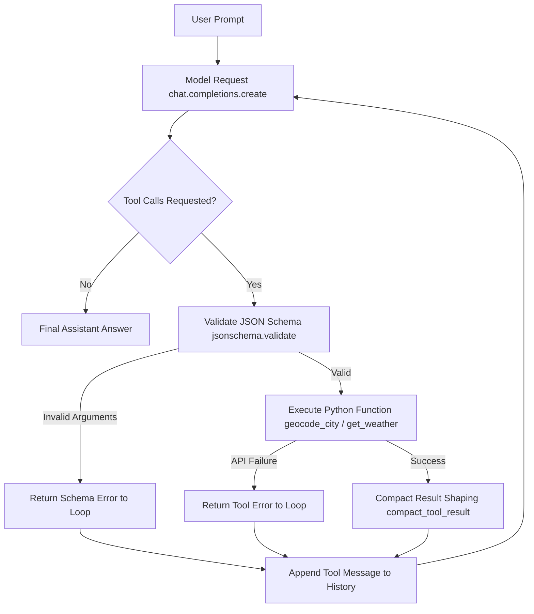

# I Built a Tool-Calling Agent in Python. Here’s How I Debugged It

> **Article Metadata**  
> **Title**: I Built a Tool-Calling Agent in Python. Here’s How I Debugged It  
> **Author**: Partha Sarkar  
> **Publication**: Towards Data Science | Enterprise Document Intelligence & Agentic AI Series  
> **Source URL**: [Towards Data Science Article](https://towardsdatascience.com/i-built-a-tool-calling-agent-in-python-heres-how-i-debugged-it/)  
> **Core Principle**: Reliability starts where the message loop is visible — A transparent two-stage tool-calling agent converts user prompts into structured tool calls, validates JSON arguments, executes external APIs, shapes compact payloads, and records evidence traces.

---

## Executive Summary & Core Debugging Philosophy

Building production tool-calling agents requires moving beyond high-level framework abstractions to inspect the raw message loop. Every agent run must answer four fundamental questions:

1. **What did the user ask?** (The initial prompt and system instructions).
2. **Which tool did the model request, and with what arguments?** (The model's emitted JSON tool call payload).
3. **What did the local Python runtime return or reject?** (Schema validation, tool execution output, or error details).
4. **What was the grounded final answer and evidence trace?** (The final response backed by execution telemetry).



---

## 1. Architectural Overview & Two-Stage Tool Loop

  
*Figure 1: Inspectable Tool-Calling Loop showing Model Request, Python Validation, Python Execution, Compact Result Shaping, Final Answer, and Trace Record — Image by Author.*

  
*Figure 2: Transparent two-stage tool-calling system converting a location into coordinates, validating them, retrieving weather forecast, and recording an evidence trace — Generated via ChatGPT.*

### Two-Stage Execution Breakdown
* **Stage 1 (Model Reasoning & Intent)**: The LLM receives user messages + tool JSON schemas. It determines whether a tool call is needed and returns function names and JSON argument strings.
* **Stage 2 (Python Runtime Execution & Validation)**:
  1. **Schema Validation**: `jsonschema.validate(instance=tool_args, schema=SCHEMAS_BY_TOOL[tool_name])`. Catches bad or missing arguments before network calls.
  2. **Tool Execution**: Invokes local functions (`geocode_city`, `get_weather`).
  3. **Result Shaping**: Strips raw API bloat down to essential keys (`compact_tool_result`).
  4. **Loop Feedback**: Appends `{ "role": "tool", "tool_call_id": id, "content": json_result }` back to `messages`.

---

## 2. Tradeoffs Matrix: Direct Loop vs. Framework Abstractions

| Path / Approach | Best When You Need | What You Give Up / Tradeoffs |
| :--- | :--- | :--- |
| **Direct Model API** *(Used Here)* | Direct access to messages, schemas, retries, logging, and cost control | You write the execution loop, turn counter, and state management yourself |
| **MCP Server** | A standard way to expose tools, resources, or prompts across multiple AI clients | You still need to design tool execution behavior, input validation, and error shapes |
| **Local Model Runtime** | Local execution, data locality, offline testing, zero API token cost | Model support, tool calling reliability, and JSON output format compliance vary |
| **Agent Framework** | Many tools, multi-agent routing, complex memory, shared team patterns | More abstraction masking the exact message flow, making deep debugging harder |

---

## 3. Complete Python Implementation (`openai_tool_calling_agent.py`)

Below is the complete, runnable Python implementation featuring Open-Meteo API integrations, `jsonschema` preflight validation, W&B Weave tracing, and CLI controls:

```python
import argparse
import json
import os
from typing import Any

import requests
from jsonschema import ValidationError, validate
from openai import OpenAI, OpenAIError

try:
    import weave
except ImportError:
    weave = None


REQUEST_TIMEOUT = 10
USER_AGENT = "tool-calling-agent-python/1.0"
MODEL = os.getenv("OPENAI_MODEL", "gpt-4o")


def geocode_city(city: str) -> dict[str, Any]:
    """Find latitude, longitude, and country for a given city via Open-Meteo."""
    url = "https://geocoding-api.open-meteo.com/v1/search"
    params = {"name": city, "count": 1, "language": "en", "format": "json"}
    headers = {"User-Agent": USER_AGENT}

    try:
        response = requests.get(url, params=params, headers=headers, timeout=REQUEST_TIMEOUT)
        response.raise_for_status()
        data = response.json()
    except requests.RequestException as exc:
        return {"error": "Geocoding API request failed", "details": str(exc)}

    results = data.get("results")
    if not results:
        return {"error": f"City not found: {city}"}

    first = results[0]
    return {
        "city": first.get("name"),
        "country": first.get("country"),
        "latitude": first.get("latitude"),
        "longitude": first.get("longitude"),
    }


def get_weather(latitude: float, longitude: float, city: str = "") -> dict[str, Any]:
    """Get compact weather report for a latitude/longitude pair via Open-Meteo."""
    url = "https://api.open-meteo.com/v1/forecast"
    params = {
        "latitude": latitude,
        "longitude": longitude,
        "current": ["temperature_2m", "precipitation", "rain", "weather_code"],
        "daily": ["weather_code", "temperature_2m_max", "temperature_2m_min", "precipitation_sum", "precipitation_probability_max"],
        "timezone": "auto",
    }
    headers = {"User-Agent": USER_AGENT}

    try:
        response = requests.get(url, params=params, headers=headers, timeout=REQUEST_TIMEOUT)
        response.raise_for_status()
        data = response.json()
    except requests.RequestException as exc:
        return {"error": "Weather API request failed", "details": str(exc)}

    current = data.get("current", {})
    daily = data.get("daily", {})

    return {
        "city": city,
        "latitude": latitude,
        "longitude": longitude,
        "temperature_c": current.get("temperature_2m"),
        "precipitation_mm": current.get("precipitation"),
        "rain_mm": current.get("rain"),
        "weather_code": current.get("weather_code"),
        "tomorrow_weather_code": daily.get("weather_code", [None, None])[1] if len(daily.get("weather_code", [])) > 1 else None,
        "tomorrow_temperature_max_c": daily.get("temperature_2m_max", [None, None])[1] if len(daily.get("temperature_2m_max", [])) > 1 else None,
        "tomorrow_temperature_min_c": daily.get("temperature_2m_min", [None, None])[1] if len(daily.get("temperature_2m_min", [])) > 1 else None,
        "tomorrow_precipitation_sum_mm": daily.get("precipitation_sum", [None, None])[1] if len(daily.get("precipitation_sum", [])) > 1 else None,
        "tomorrow_rain_chance_percent": daily.get("precipitation_probability_max", [None, None])[1] if len(daily.get("precipitation_probability_max", [])) > 1 else None,
    }


TOOLS = [
    {
        "type": "function",
        "function": {
            "name": "geocode_city",
            "description": "Find latitude, longitude, and country for a supported city.",
            "parameters": {
                "type": "object",
                "properties": {
                    "city": {
                        "type": "string",
                        "description": "City name, such as Lagos, London, or New York.",
                    }
                },
                "required": ["city"],
                "additionalProperties": False,
            },
        },
    },
    {
        "type": "function",
        "function": {
            "name": "get_weather",
            "description": "Get a compact weather report for a known location.",
            "parameters": {
                "type": "object",
                "properties": {
                    "latitude": {"type": "number"},
                    "longitude": {"type": "number"},
                    "city": {"type": "string"},
                },
                "required": ["latitude", "longitude", "city"],
                "additionalProperties": False,
            },
        },
    },
]

TOOL_REGISTRY = {
    "geocode_city": geocode_city,
    "get_weather": get_weather,
}

SCHEMAS_BY_TOOL = {
    tool["function"]["name"]: tool["function"]["parameters"]
    for tool in TOOLS
}


def compact_tool_result(result: dict[str, Any]) -> dict[str, Any]:
    if "error" in result:
        return {"error": result["error"]}

    allowed_keys = {
        "city",
        "country",
        "latitude",
        "longitude",
        "temperature_c",
        "precipitation_mm",
        "rain_mm",
        "weather_code",
        "tomorrow_weather_code",
        "tomorrow_temperature_max_c",
        "tomorrow_temperature_min_c",
        "tomorrow_precipitation_sum_mm",
        "tomorrow_rain_chance_percent",
    }
    return {key: value for key, value in result.items() if key in allowed_keys}


def execute_tool_call(tool_name: str, tool_args: dict[str, Any]) -> dict[str, Any]:
    if tool_name not in TOOL_REGISTRY:
        return {"error": f"Unknown tool: {tool_name}"}

    try:
        validate(instance=tool_args, schema=SCHEMAS_BY_TOOL[tool_name])
    except ValidationError as exc:
        return {"error": "Invalid tool arguments", "details": exc.message}

    try:
        return TOOL_REGISTRY[tool_name](**tool_args)
    except Exception as exc:
        return {"error": "Tool execution failed", "details": str(exc)}


def maybe_trace(name):
    if weave is None:
        return lambda fn: fn
    return weave.op(name=name)


@maybe_trace("run_agent")
def run_agent(user_prompt: str, max_turns: int = 4) -> dict[str, Any]:
    client = OpenAI()
    messages = [
        {
            "role": "system",
            "content": (
                "You are a concise weather assistant. "
                "Call tools only when they add facts needed for the answer."
            ),
        },
        {"role": "user", "content": user_prompt},
    ]
    transcript: list[dict[str, Any]] = []

    for turn in range(max_turns):
        try:
            response = client.chat.completions.create(
                model=MODEL,
                messages=messages,
                tools=TOOLS,
            )
        except OpenAIError as exc:
            return {
                "model": MODEL,
                "user_prompt": user_prompt,
                "answer": "",
                "error": {
                    "type": "model_request_failed",
                    "details": str(exc),
                },
                "transcript": transcript,
            }
        assistant_message = response.choices[0].message
        messages.append(assistant_message)

        tool_calls = assistant_message.tool_calls or []
        if not tool_calls:
            return {
                "model": MODEL,
                "user_prompt": user_prompt,
                "answer": assistant_message.content or "",
                "transcript": transcript,
            }

        for tool_call in tool_calls:
            tool_name = tool_call.function.name
            tool_args = json.loads(tool_call.function.arguments)
            raw_result = execute_tool_call(tool_name, tool_args)
            tool_result = compact_tool_result(raw_result)

            transcript.append(
                {
                    "turn": turn + 1,
                    "tool": tool_name,
                    "arguments": tool_args,
                    "result": tool_result,
                }
            )
            messages.append(
                {
                    "role": "tool",
                    "tool_call_id": tool_call.id,
                    "content": json.dumps(tool_result),
                }
            )

    return {
        "model": MODEL,
        "user_prompt": user_prompt,
        "answer": "I could not finish because the agent reached its tool call limit.",
        "transcript": transcript,
    }


def verify() -> dict[str, Any]:
    bad_arguments = execute_tool_call("get_weather", {"city": "Lagos"})
    unknown_tool = execute_tool_call("lookup_package", {"tracking_id": "123"})
    schema_names = sorted(SCHEMAS_BY_TOOL)
    return {
        "status": "ok",
        "model": MODEL,
        "tools": schema_names,
        "bad_arguments_check": bad_arguments,
        "unknown_tool_check": unknown_tool,
    }


def main() -> None:
    parser = argparse.ArgumentParser()
    parser.add_argument("--mode", choices=["verify", "run"], default="run")
    parser.add_argument(
        "--prompt",
        default="Should I carry an umbrella in Lagos tomorrow?",
    )
    parser.add_argument("--weave-project", default="")
    args = parser.parse_args()

    if args.mode == "verify":
        print(json.dumps(verify(), indent=2))
        return

    if args.weave_project:
        if weave is None:
            raise RuntimeError("Install weave before using --weave-project.")
        weave.init(args.weave_project)

    result = run_agent(args.prompt)
    print(json.dumps(result, indent=2))


if __name__ == "__main__":
    main()
```

---

## 4. Execution Traces & Verification Output

### Preflight Verification (`--mode verify`)
Before sending tokens to an LLM provider, verify tool schemas and error handlers locally:

```bash
python openai_tool_calling_agent.py --mode verify
```

```json
{
  "status": "ok",
  "model": "gpt-4.1",
  "tools": [
    "geocode_city",
    "get_weather"
  ],
  "bad_arguments_check": {
    "error": "Invalid tool arguments",
    "details": "'latitude' is a required property"
  },
  "unknown_tool_check": {
    "error": "Unknown tool: lookup_package"
  }
}
```

### Full Multi-Turn Execution Log (`--mode run`)

```bash
python openai_tool_calling_agent.py --mode run --prompt "Should I carry an umbrella in Lagos tomorrow?"
```

```text
[MODEL]
gpt-4.1

[USER PROMPT]
Should I carry an umbrella in Lagos tomorrow?

[OPENAI REQUESTS TOOL turn 1]
{
  "arguments": {
    "city": "Lagos"
  },
  "tool": "geocode_city"
}

[PYTHON RUNS geocode_city]
{
  "city": "Lagos",
  "country": "Nigeria",
  "latitude": 6.4550575,
  "longitude": 3.3941795
}

[OPENAI REQUESTS TOOL turn 2]
{
  "arguments": {
    "city": "Lagos",
    "latitude": 6.4550575,
    "longitude": 3.3941795
  },
  "tool": "get_weather"
}

[PYTHON RUNS get_weather]
{
  "city": "Lagos",
  "precipitation_mm": 0.0,
  "rain_mm": 0.0,
  "temperature_c": 27.7,
  "tomorrow_precipitation_sum_mm": 6.5,
  "tomorrow_rain_chance_percent": 84,
  "tomorrow_temperature_max_c": 28.9,
  "tomorrow_temperature_min_c": 24.6,
  "tomorrow_weather_code": 80,
  "weather_code": 3
}

[FINAL ANSWER]
Yes, you should carry an umbrella in Lagos tomorrow. There is a high chance of rain (84%) with about 6.5 mm of precipitation expected.
```

---

## 5. Telemetry & Visual Weave Traces

  
*Figure 3: W&B Weave trace showing geocode_city turning "Lagos" into coordinates before the weather lookup runs — Image by Author.*

  
*Figure 4: W&B Weave trace highlighting tool timeline, validated get_weather input arguments, and compact forecast payload — Image by Author.*

---

## 6. Sources & References

1. Sarkar, Partha. [I Built a Tool-Calling Agent in Python. Here’s How I Debugged It](https://towardsdatascience.com/i-built-a-tool-calling-agent-in-python-heres-how-i-debugged-it/). TDS.
2. Open-Meteo Weather Forecast API. [Open-Meteo Docs](https://open-meteo.com/en/docs).
3. JSON Schema Specification. [JSON Schema Draft](https://json-schema.org/).
4. Weights & Biases Weave Tracing. [Weave Docs](https://weave-docs.wandb.ai/).
